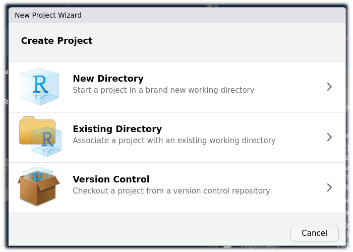
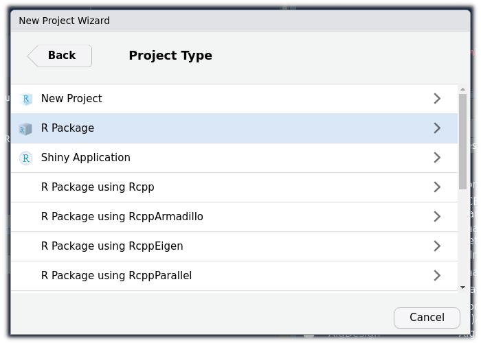
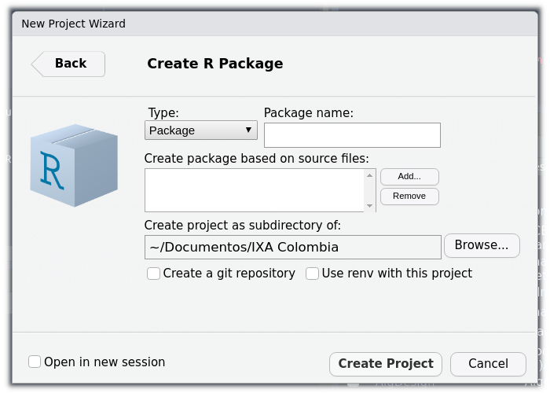

```{r setup, include=FALSE}
knitr::opts_chunk$set(echo = FALSE)
```

Con el fin de tener de recordar los pasos para la contrucción de un paquete de R decidí recopilar la información y asi tenerla a mano en caso de necesitarla

# Requerimientos: 

(1) Tener instalado R y RStudio. (2) Instalar en R los paquetes : `distill`,  `Roxygen2` y `devtools` . Tambien es necesario tener una cuenta en GitHub

# Creación del paquete

 El primer paso es abrir un nuevo proyecto ( File / New Project / New Directory)        




En la ventana que se despliega elegimos : R Package




La siguiente ventana nos permite colocar el nombre del paquete, crear un repositorio en git y usar renv con este proyecto




El resultado de este proceso es la generacion de un proyecto que contiene unos archivos y directorios predeterminados y a los cuales podemos personalizar


Ahora dentro del paquete podemos albergar : funciones, set de datos y tutoriales

# Tutoriales


# Dataset


# Funciones

